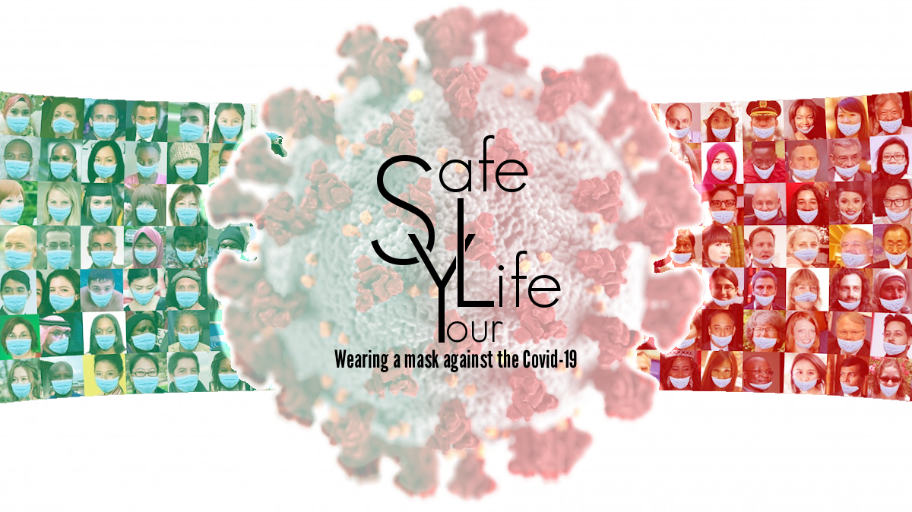
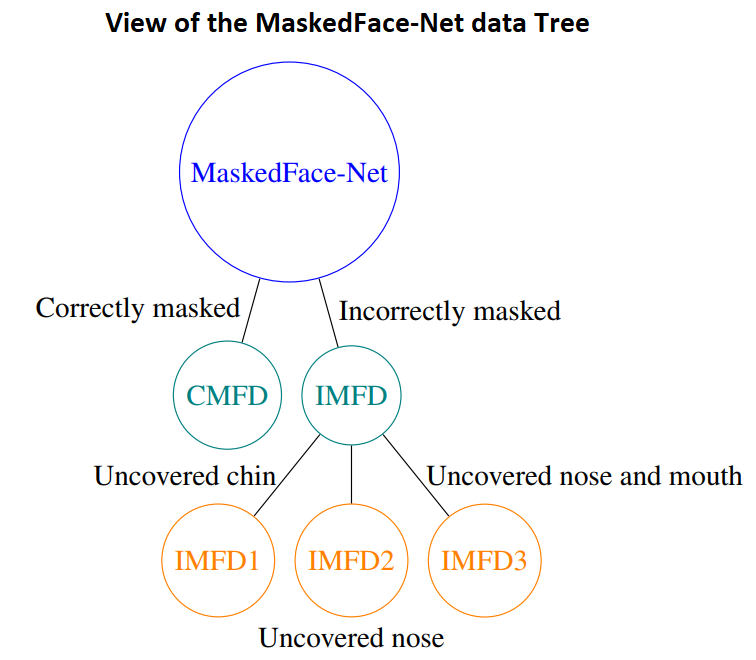
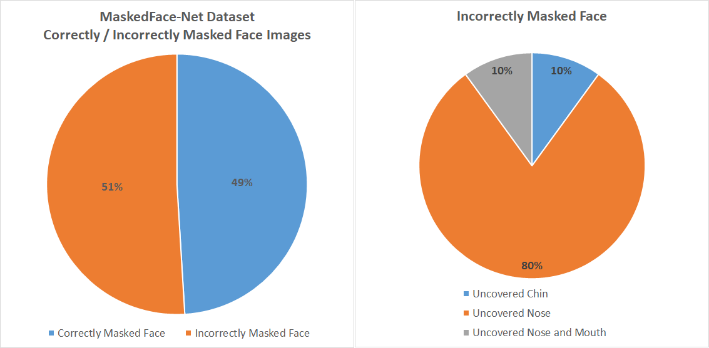

<p align="right">
<a href="https://www.facebook.com/sharer/sharer.php?u=https%3A%2F%2Fgithub.com%2Fcabani%2FMaskedFace-Net&t=MaskedFace-Net&quote="></a> 
<a href="https://twitter.com/intent/tweet?text=MaskedFace-Net%20https%3A%2F%2Fgithub.com%2Fcabani%2FMaskedFace-Net&related=AddToAny,micropat"></a>
<a href="https://www.linkedin.com/sharing/share-offsite/?url=https%3A%2F%2Fgithub.com%2Fcabani%2FMaskedFace-Net"></a>
</p>

# MaskedFace-Net

</img>

# What is MaskedFace-Net?
MaskedFace-Net is a dataset of human faces with a correctly or incorrectly worn mask (137,016 images) based on the [dataset Flickr-Faces-HQ (FFHQ)](https://github.com/NVlabs/ffhq-dataset). The wearing of the face masks appears as a solution for limiting the spread of COVID-19. In this context, efficient recognition systems are expected for checking that people faces are masked in regulated areas. To perform this task, a large dataset of masked faces is necessary for training deep learning models towards detecting people wearing masks and those not wearing masks. Some large datasets of masked faces are available in the literature. However, at the moment, there are no available large dataset of masked face images that permits to check if detected masked faces are correctly worn or not. Indeed, many people are not correctly wearing their masks due to bad practices, bad behaviors or vulnerability of individuals (e.g., children, old people). For these reasons, several mask wearing campaigns intend to sensitize people about this problem and good practices. In
this sense, this work proposes three types of masked face detection dataset; namely, the Correctly Masked Face Dataset (CMFD), the Incorrectly Masked Face Dataset (IMFD) and their combination for the global masked face detection (MaskedFace-Net). Realistic masked face datasets are proposed with a twofold objective: i) to detect people having their faces masked or not masked, ii) to detect faces having their masks correctly worn or incorrectly worn (e.g.; at airport portals or in crowds). To the best of our knowledge, no large dataset of masked faces provides such a granularity of classification towards permitting mask wearing analysis. Moreover, this work globally presents the applied mask-to-face deformable model for permitting the generation of other masked face images, notably with specific masks. 

For more details about this work:
> Adnane Cabani, Karim Hammoudi, Halim Benhabiles, and Mahmoud Melkemi, "MaskedFace-Net - A dataset of correctly/incorrectly masked face images in the context of COVID-19", Smart Health, Elsevier, 2020. [accepted, arXiv:2008.08016](https://arxiv.org/pdf/2008.08016.pdf)

# Team
<b>Project leaders: </b>
  - Adnane Cabani, ESIGELEC/IRSEEM, adnane.cabani@esigelec.fr 
  - Karim Hammoudi, Université de Haute-Alsace, IRIMAS, karim.hammoudi@uha.fr

Note: project leaders equally contributed to this work.

<b>Contributors: </b>
  - Halim Benhabiles, Yncrea Hauts-de-France, IEMN Lille, halim.benhabiles@yncrea.fr  
  - Mahmoud Melkemi, Université de Haute-Alsace, IRIMAS, mahmoud.melkemi@uha.fr

# Dataset

MaskedFace-Net is available below:

67,193 images with Correctly Masked Face Dataset (CMFD) at 1024×1024: [Go to OneDrive (19 GB)](
https://esigelec-my.sharepoint.com/:f:/g/personal/cabani_esigelec_fr/Ev3GdnQSyzxPjyzU5ElHqagBlkRCaKnnCI85iX-d1L4OHA?e=G7uaYV)

69,823 images with Incorrectly Masked Face Dataset (IMFD) at 1024×1024: [Go to OneDrive (20 GB)](https://esigelec-my.sharepoint.com/:f:/g/personal/cabani_esigelec_fr/EirjS8ew7-5LnO8I56Uk63wBKebwSlukFBFBaO8N25wn3g?e=Ho1jHG)

To facilitate the downloading of this dataset, we suggest you to use a download manager tool or OneDrive sync client.

<p align="center">
  
</p>
<p align="center">
  
</p>

<b>Metadata:</b> Each image of the MaskedFace-Net dataset has its corresponding file naming in the FFHQ dataset. Hence, the metadata file “ffhq-dataset-v2.json” (see the [FFHQ webpage](https://github.com/NVlabs/ffhq-dataset)) can be exploited for your processing of MaskedFace-Net.


# Licenses
<b>In the following the licenses of the original [FFHQ-dataset](https://github.com/NVlabs/ffhq-dataset):</b>
The individual images were published in Flickr by their respective authors under either <a href=https://creativecommons.org/licenses/by/2.0/>Creative Commons BY 2.0</a>, <a href=https://creativecommons.org/licenses/by-nc/2.0/>Creative Commons BY-NC 2.0</a>, <a href=https://creativecommons.org/publicdomain/mark/1.0/>Public Domain Mark 1.0</a>, <a href=https://creativecommons.org/publicdomain/zero/1.0/>Public Domain CC0 1.0</a>, or <a href=http://www.usa.gov/copyright.shtml>U.S. Government Works</a> license. All of these licenses allow free use, redistribution, and adaptation for non-commercial purposes. However, some of them require giving appropriate credit to the original author, as well as indicating any changes that were made to the images. The license and original author of each image are indicated in the metadata.

<ul>
  <li>https://creativecommons.org/licenses/by/2.0/</li>
  <li>https://creativecommons.org/licenses/by-nc/2.0/</li>
  <li>https://creativecommons.org/publicdomain/mark/1.0/</li>
  <li>https://creativecommons.org/publicdomain/zero/1.0/</li>
  <li>http://www.usa.gov/copyright.shtml
</ul>

The dataset itself (including JSON metadata, download script, and documentation) is made available under <a href=https://creativecommons.org/licenses/by-nc-sa/4.0/>Creative Commons BY-NC-SA 4.0</a> license by NVIDIA Corporation. You can use, redistribute, and adapt it for non-commercial purposes, as long as you (a) give appropriate credit by citing our paper, (b) indicate any changes that you've made, and (c) distribute any derivative works under the same license.
https://creativecommons.org/licenses/by-nc-sa/4.0/

<b>The licenses of MaskedFace-Net dataset:</b> The dataset is made available under <a href=https://creativecommons.org/licenses/by-nc-sa/4.0/>Creative Commons BY-NC-SA 4.0</a> license by NVIDIA Corporation. 
You can use, redistribute, and adapt it for non-commercial purposes, as long as you 
<ol type="a">
<li> give appropriate credit by citing our papers: <ol type="1"><li>Adnane Cabani, Karim Hammoudi, Halim Benhabiles, and Mahmoud Melkemi, "MaskedFace-Net - A dataset of correctly/incorrectly masked face images in the context of COVID-19", <a href=https://arxiv.org/pdf/2008.08016.pdf>arXiv:2008.08016</a>, 2020.</li> <li> Karim Hammoudi, Adnane Cabani, Halim Benhabiles, and Mahmoud Melkemi,"Validating the correct wearing of protection mask by taking a selfie: design of a mobile application "CheckYourMask" to limit the spread of COVID-19", CMES-Computer Modeling in Engineering & Sciences, Vol.124, No.3, pp. 1049-1059, 2020, <a href=https://www.techscience.com/CMES/v124n3/39927>DOI:10.32604/cmes.2020.011663</a></li></ol></li>
<li> indicate any changes that you've made, </li>
<li>and distribute any derivative works under the same license. https://creativecommons.org/licenses/by-nc-sa/4.0/ </li>
</ol>

# Bibtex references
> Adnane Cabani, Karim Hammoudi, Halim Benhabiles, and Mahmoud Melkemi, "MaskedFace-Net - A dataset of correctly/incorrectly masked face images in the context of COVID-19", Smart Health, Elsevier, 2020. [accepted, arXiv:2008.08016](https://arxiv.org/pdf/2008.08016.pdf)

```
@Article{cabani.hammoudi.2020.maskedfacenet,
    title={MaskedFace-Net -- A Dataset of Correctly/Incorrectly Masked Face Images in the Context of COVID-19},
    author={Adnane Cabani and Karim Hammoudi and Halim Benhabiles and Mahmoud Melkemi},
    journal={Smart Health},
    year={2020},
    issn={2352-6483}
}
```

>Karim Hammoudi, Adnane Cabani, Halim Benhabiles, and Mahmoud Melkemi,"Validating the correct wearing of protection mask by taking a selfie: design of a mobile application "CheckYourMask" to limit the spread of COVID-19", CMES-Computer Modeling in Engineering & Sciences, Vol.124, No.3, pp. 1049-1059, 2020, <a href=https://www.techscience.com/CMES/v124n3/39927>DOI:10.32604/cmes.2020.011663</a>

```
@Article{cmes.2020.011663,
    title={Validating the Correct Wearing of Protection Mask by Taking a Selfie: Design of a Mobile Application “CheckYourMask” to Limit the Spread of COVID-19},
    author={Karim Hammoudi, Adnane Cabani, Halim Benhabiles, Mahmoud Melkemi},
    journal={Computer Modeling in Engineering \& Sciences},
    volume={124},
    year={2020},
    number={3},
    pages={1049--1059},
    url={http://www.techscience.com/CMES/v124n3/39927},
    issn={1526-1506},
    doi={10.32604/cmes.2020.011663}
}
```

# Acknowledgements:
The authors would like to thank Mr. Jie Feng, a Columbia University PhD graduate and Creator of VisualData, for referencing our dataset on his website https://www.visualdata.io/discovery


